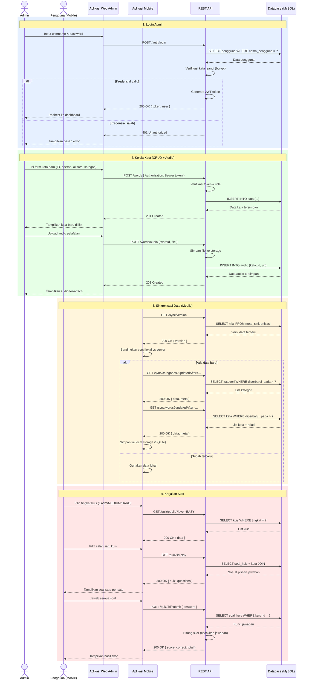

# Sequence Diagram — Kosa Kata Wolio

Gabungan 4 alur utama: Login Admin, Kelola Kata (CRUD + Audio), Sinkronisasi Mobile, dan Kerjakan Kuis.

Sumber flow: [auth.controller.ts](../src/modules/auth/auth.controller.ts), [words.controller.ts](../src/modules/words/words.controller.ts), [sync.controller.ts](../src/modules/sync/sync.controller.ts), [quiz.controller.ts](../src/modules/quiz/quiz.controller.ts).
